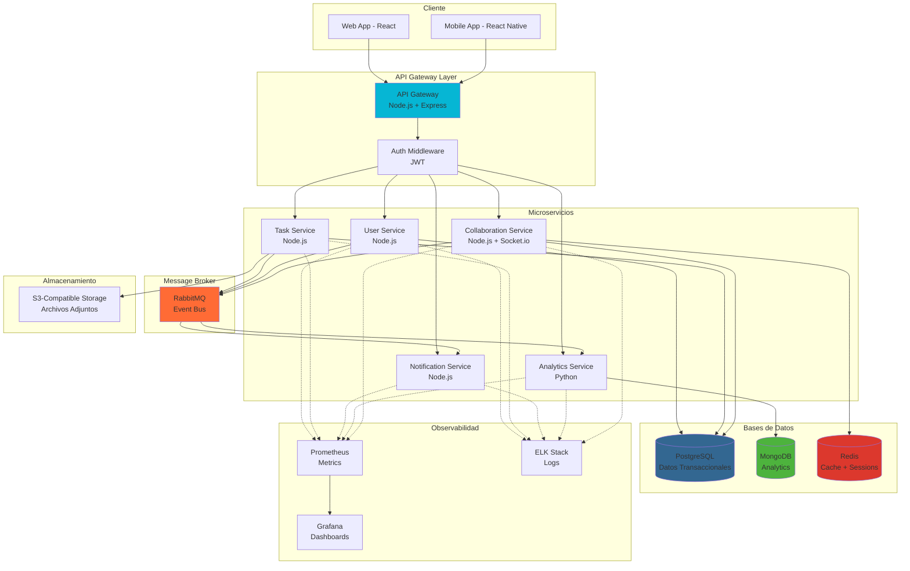
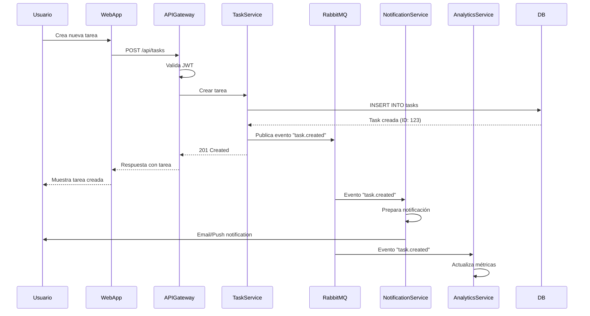

# 🏗️ Análisis Arquitectónico de 'Task Manager App'

> **Generado por:** Agente Arquitecto IA  
> **Fecha:** 12 de Noviembre, 2025  
> **Cliente:** Equipo de Desarrollo - Startup Tech  
> **Versión:** 1.0

---

## 📋 Resumen Ejecutivo

Este documento presenta el análisis arquitectónico completo de **Task Manager App**, una aplicación de gestión de tareas empresariales. El análisis fue realizado por un agente de IA especializado en arquitectura de software, que evaluó requisitos, propuso soluciones y generó diagramas técnicos.

**Objetivo del Proyecto:** Construir una aplicación escalable que permita a equipos distribuidos gestionar tareas, colaborar en tiempo real y generar reportes de productividad.

---

## 🎯 Descripción de la Arquitectura

### Arquitectura Propuesta: **Microservicios con Event-Driven Architecture**

La arquitectura recomendada para Task Manager App se basa en los siguientes principios:

#### 1. **Capa de Presentación (Frontend)**
- **Framework:** React 18 con TypeScript
- **Estado Global:** Redux Toolkit + RTK Query
- **UI Components:** Shadcn/ui + Tailwind CSS
- **Tiempo Real:** Socket.io Client
- **Responsabilidades:**
  - Interfaz de usuario reactiva
  - Gestión de estado del cliente
  - Validación de formularios
  - Notificaciones en tiempo real

#### 2. **Capa de API Gateway**
- **Tecnología:** Node.js + Express + TypeScript
- **Autenticación:** JWT con refresh tokens
- **Rate Limiting:** Redis-based throttling
- **Responsabilidades:**
  - Enrutamiento de peticiones
  - Autenticación y autorización
  - Agregación de respuestas
  - Gestión de CORS y seguridad

#### 3. **Microservicios (Backend)**

##### a) **User Service**
- Gestión de usuarios, roles y permisos
- Autenticación OAuth2 / SSO
- Base de datos: PostgreSQL

##### b) **Task Service**
- CRUD de tareas y proyectos
- Asignación de tareas
- Priorización y etiquetado
- Base de datos: PostgreSQL

##### c) **Notification Service**
- Envío de notificaciones (email, push, in-app)
- Gestión de preferencias de usuario
- Tecnología: Node.js + Bull (queue)
- Message Broker: RabbitMQ

##### d) **Analytics Service**
- Generación de reportes
- Métricas de productividad
- Dashboards en tiempo real
- Base de datos: MongoDB (datos agregados)

##### e) **Collaboration Service**
- Comentarios en tareas
- Menciones y actividad en tiempo real
- WebSocket server (Socket.io)
- Base de datos: Redis (cache) + PostgreSQL

#### 4. **Capa de Mensajería**
- **Message Broker:** RabbitMQ
- **Patrón:** Publish/Subscribe
- **Eventos:**
  - `task.created`
  - `task.assigned`
  - `task.completed`
  - `user.mentioned`
  - `comment.added`

#### 5. **Capa de Datos**
- **PostgreSQL:** Datos transaccionales (usuarios, tareas)
- **MongoDB:** Datos analíticos y logs
- **Redis:** Caché y sesiones
- **S3-compatible Storage:** Archivos adjuntos

#### 6. **Capa de Infraestructura**
- **Containerización:** Docker + Docker Compose (desarrollo)
- **Orquestación:** Kubernetes (producción)
- **CI/CD:** GitHub Actions
- **Monitoring:** Prometheus + Grafana
- **Logging:** ELK Stack (Elasticsearch, Logstash, Kibana)

---

## 🔄 Diagrama de Flujo (Arquitectura de Sistema)

### Diagrama de Componentes



### Flujo de Creación de Tarea (Secuencia)



---

## 🔐 Consideraciones de Seguridad (OWASP Top 10)

### Medidas Implementadas

1. **Autenticación y Autorización**
   - JWT con refresh tokens
   - RBAC (Role-Based Access Control)
   - MFA (Multi-Factor Authentication) opcional

2. **Validación de Entrada**
   - Sanitización en API Gateway
   - Validación con Zod/Joi en cada servicio
   - Prepared statements para SQL

3. **Protección de Datos**
   - Encriptación en tránsito (TLS 1.3)
   - Encriptación en reposo (database encryption)
   - Secretos gestionados con Vault/AWS Secrets Manager

4. **Rate Limiting**
   - Límite de 100 req/min por usuario
   - Throttling a nivel de API Gateway

5. **Logging y Auditoría**
   - Todos los eventos críticos se registran
   - Logs centralizados en ELK
   - Alertas automáticas con Prometheus

---

## 📊 Escalabilidad y Rendimiento

### Estrategias de Escalabilidad

| Componente | Estrategia | Capacidad Estimada |
|------------|------------|-------------------|
| API Gateway | Horizontal (Kubernetes HPA) | 10,000 req/s |
| Task Service | Horizontal + Sharding DB | 5,000 tareas/s |
| Notification Service | Queue-based + Workers | 50,000 notif/min |
| Collaboration Service | WebSocket + Redis Pub/Sub | 100,000 conexiones |
| PostgreSQL | Read Replicas + Connection Pooling | 20,000 conexiones |

### Optimizaciones

- **Caché:** Redis para datos frecuentes (80% cache hit rate esperado)
- **CDN:** Archivos estáticos servidos desde CDN
- **Lazy Loading:** Frontend carga componentes bajo demanda
- **Database Indexing:** Índices en campos frecuentes (user_id, status, created_at)

---

## 🚀 Plan de Despliegue

### Fase 1: MVP (Mes 1-2)
- User Service + Task Service
- Frontend básico
- PostgreSQL + Redis
- Deploy en VPS único

### Fase 2: Colaboración (Mes 3-4)
- Collaboration Service
- Notification Service
- RabbitMQ
- Deploy en Kubernetes (3 nodos)

### Fase 3: Analytics (Mes 5-6)
- Analytics Service
- MongoDB
- Dashboards avanzados
- Escalado horizontal completo

---

## 📁 Estructura de Repositorio Recomendada

```
task-manager-app/
├── frontend/                 # React App
│   ├── src/
│   ├── public/
│   └── package.json
├── services/
│   ├── user-service/        # Microservicio de usuarios
│   ├── task-service/        # Microservicio de tareas
│   ├── notification-service/
│   ├── analytics-service/
│   └── collaboration-service/
├── api-gateway/             # API Gateway
├── infrastructure/
│   ├── docker-compose.yml   # Desarrollo local
│   ├── kubernetes/          # Manifiestos K8s
│   └── terraform/           # IaC
├── shared/                  # Código compartido
│   ├── types/               # TypeScript types
│   └── utils/
└── docs/                    # Documentación
```

---

## 🎓 Ventajas de Esta Arquitectura

✅ **Escalabilidad:** Cada servicio puede escalar independientemente  
✅ **Resiliencia:** Fallo en un servicio no afecta a otros  
✅ **Mantenibilidad:** Equipos pueden trabajar en servicios independientes  
✅ **Flexibilidad Tecnológica:** Cada servicio puede usar su stack óptimo  
✅ **Despliegue Continuo:** CI/CD independiente por servicio  
✅ **Observabilidad:** Monitoring y logging centralizados  

---

## 🔍 Desafíos y Mitigaciones

| Desafío | Mitigación |
|---------|------------|
| Complejidad operacional | Kubernetes + Helm charts + IaC |
| Latencia entre servicios | Caché + Connection pooling |
| Debugging distribuido | Distributed tracing (Jaeger) |
| Consistencia de datos | Event sourcing + SAGA pattern |
| Gestión de secretos | HashiCorp Vault |

---

## 📝 Conclusión

Esta arquitectura de microservicios con event-driven design proporciona una base sólida, escalable y mantenible para **Task Manager App**. El uso de agentes de IA para generar este análisis demuestra cómo la orquestación inteligente puede acelerar el diseño arquitectónico, asegurando que se consideren las mejores prácticas desde el inicio.

**Próximos Pasos:**
1. Revisión con el equipo técnico
2. Creación de repositorios y estructura inicial
3. Setup de infraestructura de desarrollo
4. Sprint 0: Configuración de CI/CD y monitoring

---

**Generado automáticamente por el Agente Arquitecto IA**  
*Este documento demuestra cómo un agente especializado puede analizar requisitos y producir documentación técnica de alta calidad.*

