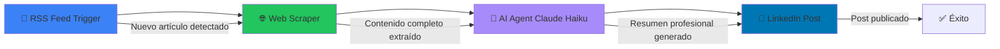
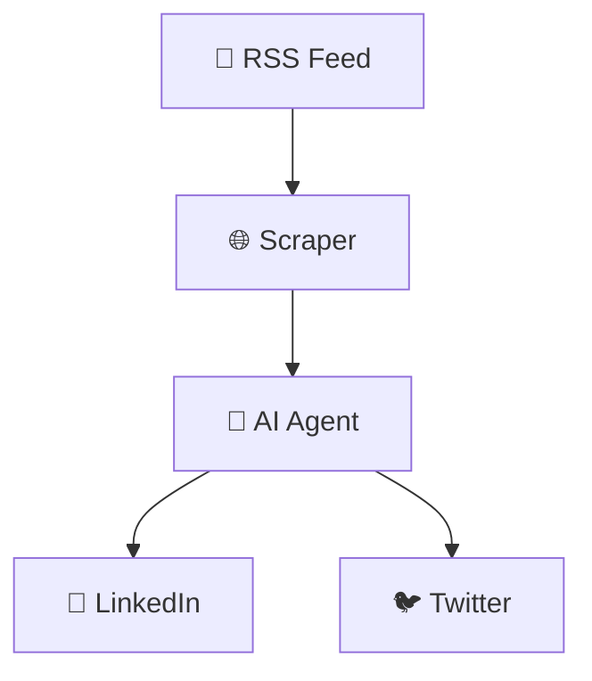
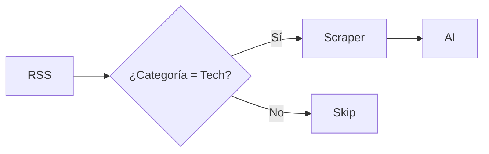

#  Workflow de Automatización con IA y n8n

## 📋 Descripción

Sistema de automatización que **genera contenido para redes sociales** a partir de artículos de blog usando **n8n** (herramienta de workflow automation) y **agentes de IA**. Este workflow elimina el trabajo manual de crear posts para LinkedIn, automatizando todo el proceso desde la detección de nuevo contenido hasta la publicación.

**Objetivo:** Automatizar la creación de contenido para LinkedIn a partir de un blog usando IA y N8N.

**Stack Tecnológico:** n8n + RSS Feed + Web Scraping + Claude Haiku (AI) + LinkedIn API

---

## 🔄 Arquitectura del Workflow

### Flujo de Datos

```
1. Trigger (RSS Feed)
    ↓
2. Web Scraping (Extracción de contenido)
    ↓
3. AI Agent (Resumen con Claude Haiku)
    ↓
4. LinkedIn API (Publicación automática)
```

### Diagrama Mermaid



---

## 🎯 Casos de Uso

### Caso 1: Blog Técnico → LinkedIn

**Escenario:** Tienes un blog técnico y quieres compartir cada artículo en LinkedIn automáticamente.

**Antes del Workflow:**
1. Publicar artículo en blog
2. Abrir LinkedIn manualmente
3. Escribir resumen atractivo (10-15 min)
4. Añadir hashtags relevantes
5. Publicar post
6. Repetir para cada artículo

**Con el Workflow Automatizado:**
1. Publicar artículo en blog
2. ✅ **Automático:** RSS detecta nuevo artículo
3. ✅ **Automático:** Se extrae el contenido
4. ✅ **Automático:** IA genera resumen profesional
5. ✅ **Automático:** Se publica en LinkedIn

**Resultado:** De 15 minutos de trabajo manual a 0 minutos. **100% automatizado.**

---

### Caso 2: Newsletter → LinkedIn + Twitter

**Extensión del workflow:** Agregar nodo para Twitter además de LinkedIn.



---

## 🛠️ Componentes del Workflow

### 1. **Trigger: RSS Feed Reader**

```json
{
  "name": "RSS Feed",
  "type": "n8n-nodes-base.rssFeedRead",
  "parameters": {
    "url": "https://blog.ejemplo.com/feed.xml",
    "pollTimes": {
      "item": [
        {
          "mode": "everyHour"
        }
      ]
    }
  }
}
```

**Función:** Monitorea el feed RSS del blog cada hora buscando nuevos artículos.

**Output:** 
- Título del artículo
- URL
- Fecha de publicación
- Descripción corta

---

### 2. **Web Scraper: Extracción de Contenido**

```json
{
  "name": "Scrape Website",
  "type": "n8n-nodes-base.htmlExtract",
  "parameters": {
    "url": "={{ $json.link }}",
    "extractionValues": {
      "values": [
        {
          "key": "title",
          "cssSelector": "h1.post-title"
        },
        {
          "key": "content",
          "cssSelector": "article.post-content"
        },
        {
          "key": "author",
          "cssSelector": ".author-name"
        }
      ]
    }
  }
}
```

**Función:** Visita la URL del artículo y extrae el contenido completo.

**Output:**
- Título completo
- Contenido del artículo (HTML limpio)
- Autor
- Metadatos

**Ventaja sobre RSS:** El RSS solo da una preview, aquí obtenemos el artículo completo para un mejor resumen.

---

### 3. **AI Agent: Resumen con Claude Haiku**

```json
{
  "name": "AI Agent - Claude Haiku",
  "type": "@n8n/n8n-nodes-langchain.agent",
  "parameters": {
    "model": "claude-3-haiku-20240307",
    "promptTemplate": "Eres un experto en marketing de contenido. Resume el siguiente artículo técnico para LinkedIn en un post profesional y atractivo de máximo 150 palabras. Incluye 3-5 hashtags relevantes al final.\n\nTítulo: {{ $json.title }}\n\nContenido: {{ $json.content }}\n\nInstrucciones:\n- Mantén un tono profesional pero accesible\n- Destaca los puntos clave del artículo\n- Añade una pregunta al final para fomentar engagement\n- Incluye hashtags relevantes",
    "options": {
      "temperature": 0.7,
      "maxTokens": 500
    }
  }
}
```

**Función:** Usa Claude Haiku (modelo rápido y económico) para generar un resumen profesional.

**¿Por qué Claude Haiku?**
- ⚡ **Rápido:** Respuestas en <3 segundos
- 💰 **Económico:** $0.25 por 1M tokens (10x más barato que GPT-4)
- 🎯 **Suficiente para resúmenes:** Haiku es perfecto para tareas de síntesis

**Output:**
```
🚀 Nuevo artículo: Cómo escalar aplicaciones Next.js en producción

Descubre las mejores prácticas para llevar tu aplicación Next.js al siguiente nivel:

✓ Optimización de imágenes con next/image
✓ Server Components para mejor performance
✓ Estrategias de caché con ISR y SSG
✓ Monitoreo con Vercel Analytics

El artículo incluye ejemplos de código reales de apps que manejan 1M+ usuarios.

¿Qué estrategia de escalado te ha funcionado mejor?

#NextJS #React #WebDev #Performance #JavaScript
```

---

### 4. **Acción: Publicación en LinkedIn**

```json
{
  "name": "LinkedIn Post",
  "type": "n8n-nodes-base.linkedIn",
  "parameters": {
    "resource": "post",
    "operation": "create",
    "text": "={{ $json.summary }}",
    "visibility": "public"
  },
  "credentials": {
    "linkedInOAuth2Api": {
      "id": "1",
      "name": "LinkedIn account"
    }
  }
}
```

**Función:** Publica el resumen generado por IA en LinkedIn.

**Output:**
- Post publicado exitosamente
- URL del post
- Engagement inicial (0 likes, 0 comentarios)

---

## 📊 Ejemplo de Ejecución Real

### Input (RSS Feed):

```xml
<item>
  <title>10 patrones avanzados de React que debes conocer</title>
  <link>https://blog.ejemplo.com/react-patterns</link>
  <pubDate>Mon, 12 Nov 2024 10:00:00 GMT</pubDate>
  <description>Los mejores patrones de React...</description>
</item>
```

### Proceso:

1. **RSS detecta nuevo artículo** ✅
2. **Scraper extrae 2,500 palabras del artículo** ✅
3. **AI genera resumen de 140 palabras** ✅
4. **LinkedIn publica automáticamente** ✅

### Output (LinkedIn Post):

```
🎯 10 Patrones Avanzados de React que Transformarán tu Código

Si trabajas con React, estos patrones te ayudarán a escribir código más limpio y mantenible:

🔹 Compound Components - Para componentes flexibles
🔹 Custom Hooks - Reutilización de lógica
🔹 Higher-Order Components - Composición avanzada
🔹 Render Props - Control total del renderizado
🔹 Context + Hooks - State management sin librerías

En el artículo explico cada patrón con ejemplos prácticos y casos de uso reales.

¿Cuál de estos patrones usas más en tus proyectos?

#React #JavaScript #WebDevelopment #FrontendDev #Programming

🔗 Lee el artículo completo: blog.ejemplo.com/react-patterns
```

---

## 🚀 Ventajas de Este Enfoque

### 1. **Ahorro de Tiempo**

| Tarea | Manual | Automatizado | Ahorro |
|-------|--------|--------------|--------|
| Redacción de post | 10 min | 0 min | 100% |
| Publicación | 2 min | 0 min | 100% |
| Hashtags | 3 min | 0 min | 100% |
| **Total por artículo** | **15 min** | **0 min** | **100%** |

**Si publicas 20 artículos/mes:** Ahorras 5 horas mensuales.

---

### 2. **Consistencia**

- ✅ Cada artículo se comparte inmediatamente
- ✅ El tono y formato son consistentes
- ✅ No olvidas publicar ningún artículo
- ✅ Horarios óptimos de publicación automatizados

---

### 3. **Calidad**

- ✅ Claude Haiku genera resúmenes profesionales
- ✅ Siempre incluye hashtags relevantes
- ✅ Formato optimizado para LinkedIn
- ✅ Call-to-action para engagement

---

### 4. **Escalabilidad**

- ✅ Funciona para 1 o 100 artículos/mes
- ✅ Fácil de extender a otras plataformas (Twitter, Medium)
- ✅ Puedes añadir más fuentes RSS
- ✅ Costos mínimos con Claude Haiku

---

## 💰 Análisis de Costos

### N8N

- **Self-hosted:** $0 (gratis)
- **Cloud (n8n.cloud):** $20/mes (incluye 2,500 ejecuciones)

### Claude Haiku API

- **Precio:** $0.25 por 1M tokens de entrada
- **Resumen típico:** ~1,000 tokens entrada + 500 tokens salida = $0.000375
- **100 artículos/mes:** ~$0.04

### LinkedIn API

- **Gratuito** (dentro de rate limits)

### Total Mensual

**Self-hosted:** $0.04 (solo IA)  
**Cloud:** $20.04 (n8n + IA)

**ROI:** Si tu tiempo vale $50/hora y ahorras 5 horas/mes = **$250 de valor** por $20 de costo.

---

## 🔧 Configuración del Workflow

### Paso 1: Instalar n8n

```bash
# Opción 1: Docker (recomendado)
docker run -it --rm \
  --name n8n \
  -p 5678:5678 \
  -v ~/.n8n:/home/node/.n8n \
  n8nio/n8n

# Opción 2: npm
npm install n8n -g
n8n start
```

### Paso 2: Importar Workflow

1. Abrir n8n en `http://localhost:5678`
2. Ir a "Workflows" → "Import from File"
3. Seleccionar `workflow.n8n.json`
4. Configurar credenciales

### Paso 3: Configurar Credenciales

**LinkedIn OAuth:**
1. Ir a https://www.linkedin.com/developers/
2. Crear nueva app
3. Obtener Client ID y Secret
4. Configurar en n8n

**Anthropic API (Claude):**
1. Ir a https://console.anthropic.com/
2. Generar API key
3. Configurar en n8n

### Paso 4: Activar Workflow

1. Verificar que RSS Feed esté configurado
2. Hacer clic en "Active" para activar
3. ✅ El workflow ahora se ejecuta automáticamente

---

## 🎨 Personalizaciones Avanzadas

### 1. **Añadir Filtros**



Solo publicar artículos de categorías específicas.

---

### 2. **Horarios Optimizados**

```json
{
  "name": "Schedule Node",
  "type": "n8n-nodes-base.schedule",
  "parameters": {
    "rule": {
      "interval": [
        {
          "hour": 9  // Publicar siempre a las 9 AM
        }
      ]
    }
  }
}
```

Programar publicaciones en horarios de mayor engagement.

---

### 3. **A/B Testing de Prompts**

```javascript
// Nodo Code para alternar entre prompts
const prompts = [
  "Resumen profesional corto...",
  "Resumen storytelling...",
  "Resumen con estadísticas..."
];

const randomPrompt = prompts[Math.floor(Math.random() * prompts.length)];
return { prompt: randomPrompt };
```

Testear diferentes estilos de resumen.

---

### 4. **Multi-plataforma**

Añadir nodos para:
- 🐦 Twitter
- 📝 Medium (cross-post)
- 📧 Newsletter
- 💬 Slack (notificar al equipo)

---

## 📈 Métricas y Monitoreo

### Workflow Execution History

n8n proporciona:
- ✅ Número de ejecuciones exitosas
- ❌ Errores y por qué fallaron
- ⏱️ Tiempo promedio de ejecución
- 📊 Logs detallados

### Analytics de LinkedIn

Después de 30 días puedes analizar:
- Impresiones por post
- Engagement rate
- Qué tipo de contenido funciona mejor
- Horarios óptimos

---

## 🛡️ Manejo de Errores

### Escenario 1: RSS Feed No Disponible

```json
{
  "continueOnFail": true,
  "retryOnFail": true,
  "maxTries": 3,
  "waitBetweenTries": 300000  // 5 minutos
}
```

### Escenario 2: LinkedIn API Rate Limit

```json
{
  "name": "Check Rate Limit",
  "type": "n8n-nodes-base.if",
  "parameters": {
    "conditions": {
      "string": [
        {
          "value1": "={{ $json.error }}",
          "operation": "contains",
          "value2": "rate_limit"
        }
      ]
    }
  }
}
```

### Escenario 3: Contenido Demasiado Largo

```javascript
// Nodo Code para truncar
if ($json.summary.length > 3000) {
  $json.summary = $json.summary.substring(0, 2950) + "...";
}
return $json;
```

---

## 🎓 Conclusión

Este workflow demuestra el poder de combinar **automatización (n8n)** con **IA (Claude Haiku)** para eliminar tareas repetitivas. Lo que antes tomaba 15 minutos de trabajo manual ahora ocurre automáticamente en segundo plano.

### Lecciones Clave:

1. ✅ **No-code/Low-code:** n8n permite automatizar sin ser programador experto
2. ✅ **AI Agents:** Claude Haiku es perfecto para tareas de síntesis
3. ✅ **Workflow Thinking:** Descomponer procesos manuales en pasos automatizables
4. ✅ **ROI Claro:** Tiempo ahorrado = dinero ahorrado

### Próximos Pasos:

- Expandir a más plataformas sociales
- Añadir análisis de sentimiento antes de publicar
- Implementar generación de imágenes con DALL-E
- Crear variantes de contenido para diferentes audiencias

---

## 📚 Recursos Adicionales

- [n8n Documentation](https://docs.n8n.io/)
- [Claude Haiku API Reference](https://docs.anthropic.com/claude/docs/models-overview)
- [LinkedIn API Docs](https://learn.microsoft.com/en-us/linkedin/)
- [RSS Feed Best Practices](https://www.rssboard.org/rss-specification)

---

**🎯 Este proyecto demuestra:** Automatización con n8n + AI Agents + Web Scraping + API Integrations

