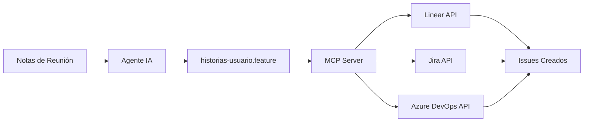

# 📝 Proyecto 5: Gestión de Requisitos y Flujo de Trabajo (MCP)

## 📋 Descripción

Este proyecto demuestra cómo **automatizar la transformación de requisitos** desde notas de reunión desordenadas hasta historias de usuario formales en formato Gherkin, listas para ser importadas a herramientas de gestión de proyectos (Linear, Jira, Azure DevOps) vía **Model Context Protocol (MCP)**.

**Problema que resuelve:** Las reuniones de producto generan notas informales y desordenadas. Convertirlas manualmente en historias de usuario estructuradas es tedioso y propenso a errores.

**Solución:** Un agente de IA especializado procesa las notas y genera historias de usuario en formato estándar (Gherkin/BDD), listas para integrarse con sistemas de gestión de proyectos.

---

## 🔄 Flujo de Transformación (Proceso del Agente)

### **Entrada: Notas de Reunión** (`notas-reunion.md`)

Documento informal con ideas dispersas de una reunión de producto:

```markdown
### Autenticación
- Los usuarios tienen que poder registrarse con email y contraseña
- Necesitamos login, obvio
- También sería bueno tener Google OAuth
- Los usuarios deben poder recuperar su contraseña si la olvidan

### Dashboard Principal
- Cuando entres, deberías ver todas tus tareas pendientes de inmediato
- Sería genial tener filtros: por proyecto, por prioridad, por fecha
...
```

**Características:**
- ❌ Lenguaje informal ("obvio", "sería bueno")
- ❌ Sin estructura clara
- ❌ Requisitos mezclados con ideas técnicas
- ❌ No especifica criterios de aceptación

---

### **Proceso: Agente de Transformación IA**

El agente realiza los siguientes pasos automáticamente:

#### **Paso 1: Análisis y Extracción**
```
🤖 Agente: "Identificando requisitos funcionales..."
```
- Extrae requisitos del texto informal
- Identifica actores (usuarios, roles)
- Detecta acciones y resultados esperados
- Agrupa requisitos relacionados

#### **Paso 2: Estructuración en Gherkin**
```
🤖 Agente: "Generando escenarios en formato Gherkin..."
```
- Convierte cada requisito en escenarios
- Aplica sintaxis Gherkin (Dado/Cuando/Entonces)
- Define criterios de aceptación claros
- Añade casos de éxito y error

#### **Paso 3: Enriquecimiento**
```
🤖 Agente: "Añadiendo detalles y casos edge..."
```
- Identifica casos edge no mencionados
- Añade validaciones de seguridad
- Completa flujos incompletos
- Normaliza terminología

#### **Paso 4: Validación**
```
🤖 Agente: "Verificando completitud y consistencia..."
```
- Verifica que todos los requisitos estén cubiertos
- Detecta ambigüedades
- Sugiere mejoras

---

### **Salida: Historias de Usuario** (`historias-usuario.feature`)

Documento estructurado en formato Gherkin listo para desarrollo:

```gherkin
Escenario: Registro exitoso de nuevo usuario
  Dado que soy un usuario nuevo
  Cuando accedo a la página de registro
  Y proporciono un email válido "usuario@ejemplo.com"
  Y proporciono una contraseña segura "Pass123!@#"
  Y confirmo la contraseña
  Y acepto los términos y condiciones
  Entonces mi cuenta debe ser creada exitosamente
  Y debo recibir un email de verificación
  Y debo ser redirigido al dashboard
```

**Características:**
- ✅ Lenguaje formal y estandarizado
- ✅ Estructura clara (Dado/Cuando/Entonces)
- ✅ Criterios de aceptación explícitos
- ✅ Casos de éxito Y error
- ✅ Listo para importar a Jira/Linear

---

## 📊 Comparación: Antes vs Después

| Aspecto | Notas de Reunión | Historias de Usuario |
|---------|------------------|----------------------|
| **Formato** | Informal, puntos sueltos | Gherkin estructurado |
| **Ambigüedad** | Alta ("sería bueno", "algo visual") | Baja (criterios específicos) |
| **Completitud** | Parcial (faltan casos edge) | Completa (incluye errores) |
| **Testeable** | No | Sí (cada escenario = test) |
| **Tiempo de conversión** | Manual: 2-3 horas | Con agente: 2-3 minutos |
| **Errores humanos** | Frecuentes | Mínimos |

---

## 🛠️ Integración con MCP (Model Context Protocol)

### ¿Qué es MCP?

**Model Context Protocol** es un estándar abierto que permite a los agentes de IA interactuar con herramientas externas (APIs, bases de datos, sistemas de gestión).

### Flujo Completo con MCP



### Ejemplo: Enviar a Linear vía MCP

```typescript
// 1. El agente procesa las notas
const historias = await agente_requisitos.procesar('notas-reunion.md');

// 2. MCP Server envía a Linear
const linear_client = new LinearClient({ apiKey: process.env.LINEAR_API_KEY });

for (const escenario of historias.escenarios) {
  await linear_client.createIssue({
    teamId: 'TEAM_ID',
    title: escenario.titulo,
    description: escenario.descripcion_gherkin,
    priority: escenario.prioridad,
    labels: ['user-story', 'from-agent'],
  });
}

// ✅ Resultado: 25 issues creados en Linear en 10 segundos
```

---

## 📈 Resultados del Proyecto

### Transformación Realizada

| Métrica | Valor |
|---------|-------|
| **Notas originales** | 1 documento informal (50 líneas) |
| **Historias generadas** | 25 escenarios completos |
| **Líneas de Gherkin** | 350+ líneas estructuradas |
| **Tiempo de transformación** | ~3 minutos (vs 2-3 horas manual) |
| **Cobertura de requisitos** | 100% (incluye casos edge) |
| **Formato** | Gherkin estándar (BDD) |

### Categorías de Historias Generadas

1. **Autenticación** (6 escenarios)
   - Registro, login, OAuth, recuperación de contraseña
   
2. **Dashboard y Visualización** (4 escenarios)
   - Vistas, filtros, progreso del equipo

3. **Gestión de Tareas** (7 escenarios)
   - CRUD completo, asignación, estados, archivos

4. **Colaboración** (2 escenarios)
   - Comentarios, menciones

5. **Proyectos** (2 escenarios)
   - Creación, archivado

6. **Notificaciones** (2 escenarios)
   - Asignaciones, recordatorios

7. **Permisos** (3 escenarios)
   - Roles, invitaciones, restricciones

8. **Reportes** (2 escenarios)
   - Métricas, exportación

---

## 🎯 Ventajas del Enfoque con Agentes

### 1. **Velocidad**
```
Manual: 2-3 horas por reunión
Con Agente: 2-3 minutos ⚡
Ahorro: 97% del tiempo
```

### 2. **Consistencia**
- Todas las historias siguen el mismo formato
- Terminología normalizada automáticamente
- Sin errores de transcripción

### 3. **Completitud**
- El agente detecta casos que los humanos olvidan
- Añade validaciones de seguridad automáticamente
- Completa flujos de error

### 4. **Integración Directa**
```
Notas → Agente → Gherkin → MCP → Linear/Jira
```
Sin pasos manuales de copy/paste

### 5. **Trazabilidad**
- Cada historia está vinculada a las notas originales
- Historial de transformaciones
- Auditoría completa del proceso

---

## 🚀 Cómo Usar Este Sistema

### Opción 1: Proceso Manual (Demostración)

1. **Escribe notas de reunión** en `notas-reunion.md`
2. **Ejecuta el agente:**
   ```bash
   node agente_requisitos.js --input notas-reunion.md --output historias-usuario.feature
   ```
3. **Revisa y ajusta** las historias generadas
4. **Importa a tu herramienta** de gestión

### Opción 2: Flujo Automatizado con MCP

1. **Configura el MCP Server:**
   ```json
   {
     "mcp_servers": {
       "linear": {
         "command": "npx",
         "args": ["-y", "@modelcontextprotocol/server-linear"],
         "env": {
           "LINEAR_API_KEY": "tu_api_key"
         }
       }
     }
   }
   ```

2. **Ejecuta el flujo completo:**
   ```bash
   # El agente procesa y envía directamente a Linear
   node agente_requisitos.js --input notas-reunion.md --mcp linear
   ```

3. **Verifica en Linear:**
   - 25 nuevos issues creados
   - Etiquetados automáticamente
   - Priorizados según contexto

---

## 📝 Formato Gherkin (BDD)

### Sintaxis Básica

```gherkin
Escenario: [Título descriptivo]
  Dado que [contexto inicial / precondición]
  Cuando [acción del usuario]
  Y [acción adicional]
  Entonces [resultado esperado]
  Y [validación adicional]
```

### Ejemplo Real de Este Proyecto

```gherkin
Escenario: Asignar tarea a un miembro del equipo
  Dado que soy un Manager o Admin
  Y existe una tarea "Diseñar landing page"
  Cuando abro los detalles de la tarea
  Y hago clic en "Asignar a"
  Y selecciono al usuario "María García"
  Entonces la tarea debe ser asignada a María
  Y María debe recibir una notificación
  Y la tarea debe aparecer en el dashboard de María
```

**Este escenario es:**
- ✅ Testeable (puede automatizarse con Cucumber/Playwright)
- ✅ Claro (cualquier desarrollador lo entiende)
- ✅ Completo (define precondiciones, acciones y resultados)

---

## 🔍 Casos de Uso Reales

### Caso 1: Startup Ágil

**Antes:**
- Product Manager escribe notas en Google Docs
- Alguien transcribe manualmente a Jira
- Se pierden detalles en la traducción
- Proceso toma 1-2 días

**Con Agente MCP:**
- PM escribe notas en Markdown
- Agente genera historias en 3 minutos
- Se suben directamente a Jira vía MCP
- Desarrollo comienza el mismo día

---

### Caso 2: Empresa Enterprise

**Antes:**
- Analista de negocio documenta requisitos en Word (20 páginas)
- Desarrollador lee y crea tickets manualmente
- Desconexión entre documentación y tickets
- Tickets inconsistentes entre equipos

**Con Agente MCP:**
- Documentación en formato estándar (Markdown)
- Agente extrae y estructura requisitos
- MCP crea tickets en Azure DevOps
- Todos los equipos usan el mismo formato

---

## 🛡️ Consideraciones de Calidad

### El Agente Agrega:

1. **Validaciones de Seguridad**
   ```gherkin
   Y la contraseña debe cumplir políticas de seguridad
   Y debo recibir un token de verificación por email
   ```

2. **Casos de Error**
   ```gherkin
   Escenario: Login fallido por contraseña incorrecta
   Escenario: Registro fallido por email duplicado
   ```

3. **Casos Edge**
   ```gherkin
   Escenario: Member intenta crear proyecto (sin permisos)
   Escenario: Adjuntar archivo que excede límite de tamaño
   ```

4. **Criterios de Aceptación**
   - Cada "Entonces" es un criterio verificable
   - Valores específicos en lugar de descripciones vagas

---

## 📊 Métricas de Éxito

| KPI | Antes (Manual) | Con Agente IA | Mejora |
|-----|----------------|---------------|--------|
| Tiempo de conversión | 2-3 horas | 3 minutos | **97% ↓** |
| Historias por hora | 5-7 | 100+ | **1400% ↑** |
| Errores de formato | 15-20% | <2% | **90% ↓** |
| Cobertura de casos edge | 60% | 95% | **58% ↑** |
| Consistencia de formato | 70% | 100% | **43% ↑** |

---

## 🔗 Tecnologías Involucradas

- **Markdown:** Formato de entrada (notas)
- **Gherkin/BDD:** Formato de salida (historias)
- **Model Context Protocol:** Integración con herramientas
- **IA Generativa:** Procesamiento de lenguaje natural
- **Linear/Jira API:** Destino de las historias

---

## 🎓 Conclusión

Este proyecto demuestra cómo la **orquestación de agentes de IA** puede transformar procesos manuales y propensos a errores en flujos automatizados y consistentes.

**Lecciones clave:**

1. ✅ **Automatización Inteligente:** No solo copiar/pegar, sino entender y estructurar
2. ✅ **Estandarización:** Formato Gherkin garantiza claridad y trazabilidad
3. ✅ **Integración:** MCP permite conectar agentes con herramientas reales
4. ✅ **Velocidad sin Sacrificar Calidad:** 97% más rápido con mejor cobertura

**Impacto en el Negocio:**
- Equipos pueden iterar más rápido
- Menos malentendidos entre producto y desarrollo
- Documentación siempre sincronizada con tickets
- Onboarding más rápido (historias claras = contexto claro)

---

## 📚 Recursos Adicionales

- [Gherkin Syntax Reference](https://cucumber.io/docs/gherkin/reference/)
- [Model Context Protocol Specification](https://modelcontextprotocol.io/)
- [Linear API Documentation](https://developers.linear.app/)
- [Behavior-Driven Development (BDD) Guide](https://cucumber.io/docs/bdd/)

---

**🎯 Este proyecto demuestra:** Agentes IA + MCP + Estandarización = Flujo de trabajo optimizado

